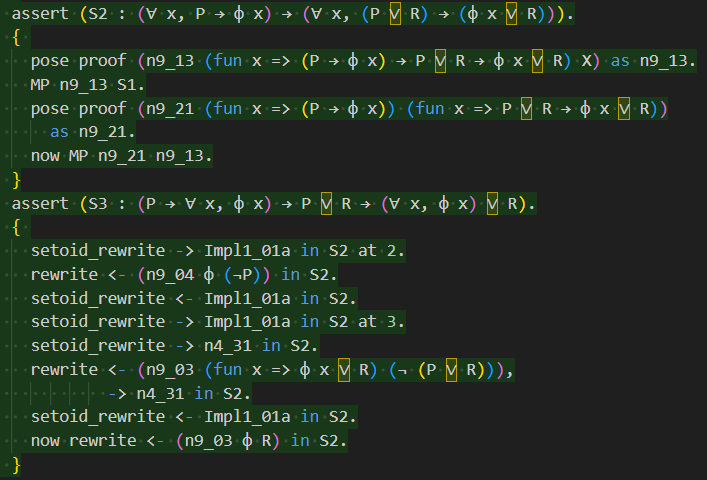

# Neo Principia
[](https://www.youtube.com/watch?v=MMD9n-YZ93o)

Continuation of [Principia Mathematica's formalization](https://github.com/LogicalAtomist/principia) by Landon Elkind.

**WARNING: the documentation is currently under heavy WIP and can be highly volatile**

## Why working on it
- Principia Mathematica has a stable version
- Principia Mathematica is not textbook math
- Formalized PM is a good textbook for verifiers
- Formalizing PM feels like building an obelisk
- Rocq doesn't need a lot of version updates

## How well have you formalized?
Which means 3 questions:

- **How much can you formalize?** Theoretically, the whole book. See [overview](./docs/1_overview.md/#can-principia-mathematica-be-completely-formalized) for analysis and features.
- **How much have you formalized?** 199 - 94 = 105 pages. See [mechanics](./docs/3_mechanics.md) for detailed discussions.
- **How deep can you formalize?** We're using shallow embedding, which is not rigorous deep embedding. We didn't type the propositions, so **the proofs are still not 100% correct.** See [audit](./docs/5_audit.md) for our major defects.

## Running the code
Coq/Rocq version: >= 8.20.0, < 9.0, installed with the [opam](https://opam.ocaml.org/) environment:

```bash
opam update
opam install coq
opam pin add coq 8.20.0
```
Running the project:

```bash
make
```

The awesome `Makefile` gathered from [@clarus](https://github.com/clarus)'s [awesome repo](https://github.com/formal-land/rocq-of-rust), is supposed to automatically detect all `.v` files under the `pm` folder, generate the `_CoqProject` file and compile the whole folder. This is done without deploying the project with `dune` environment.

### Running the code, line by line
IDEs for Coq/Rocq varies, but here is my preference:

- WSL instance: Ubuntu 18.04 on WSL 2
- VS Code version: 1.80.0
- Extension installed on VSCode locally: WSL. When running the extension, it will generate a notification to help you install VSCode support in the current WSL instance.
- Extension installed on VSCode, in its remote WSL environment: VSCoq v0.3.7 from [OpenVSX](https://open-vsx.org/extension/maximedenes/vscoq).

## To contribute
Although I have tried to organize the issues well to indicate the current progress, I don't have rich experience in collaborations. A contribution guideline is currently working in progress. It's still suggested to open a new issue for inquiries, and I'll see what I can give.

## Related works
- [Landon Elkind's formalization of PM](https://github.com/LogicalAtomist/principia)
- [ndrwnaguib's formalization of PM in Lean](https://github.com/ndrwnaguib/principia)
- [Randall Holmes's RTT implementation](https://github.com/Randall-Holmes/Randall-Holmes.github.io/tree/master/RTT)
- [xamidi's propositional calculus theorems](https://github.com/xamidi/luk-pmproofs) from [Łukasiewicz's L1-system](https://www.jstage.jst.go.jp/article/pjab1945/41/6/41_6_436/_pdf)
- Also his [pmGenerator](https://github.com/xamidi/pmGenerator) generating minimal proofs for a collection of PM theorems
- [Metamath solitaire's implementation on propositional calculus theorems](https://us.metamath.org/mmsolitaire/pmproofs.txt)

## Other useful links
- [1](https://proofassistants.stackexchange.com/questions/1105/how-does-the-formal-proof-of-the-four-color-theorem-work) Discussion of the 4-color theorem, as a reflection. 
- [2](https://plato.stanford.edu/entries/pm-notation/) SEP's entry on PM
- [3](https://en.wikipedia.org/wiki/Glossary_of_Principia_Mathematica) Wiki's entry on PM
- [4](https://mathoverflow.net/questions/27793/russell-and-whiteheads-types-ramified-and-unramified) MO QA
- [5](https://mathoverflow.net/questions/115967/how-to-get-the-modern-logic-formulas-in-principia-mathematica) MP QA 2
- [6](https://blog.plover.com/math/PM.html) A rare post that goes over chapter 20 giving insights to PM!
- [7](https://www.religion-online.org/article/the-axiomatic-matrix-of-whiteheads-process-and-reality/) One link that helps me understand what is matrix
- [8](https://nap.nationalacademies.org/read/10866/chapter/66) Another random material that I think related to the matrix in PM
- [9](https://www.ens-lyon.fr/LIP/PLUME/production/) A site containing nice papers with better technologies to digest, although unused in this project
- [10](https://mulpress.mcmaster.ca/russelljournal/article/download/5046/4059/17479) Landini, Gregory. (2022). Note on Principia's *38 on Operations. Russell: the Journal of Bertrand Russell Studies. 41. 10.15173/russell.v41i2.5046. 
