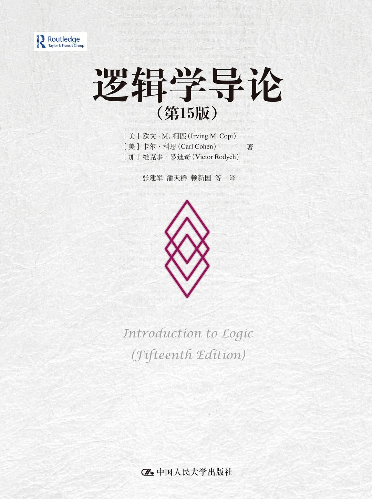

# 背景铺垫：传统逻辑

1. 较次的方法是看网上各种书或者基础教程，或者辩论赛、模拟庭审、《忽悠的原理与技巧》；最正经一点的方法是Copi（TODO：截图）
2. 理论上逻辑能“提高国民素养”；实际上哪怕是Copi，实际上很多人学出来以为是逻辑悖论
3. 过早的逻辑批判拒绝了沟通

- 日常对话需要有自己的理解
- 讲逻辑不是讲分析
- 权威批评：参考SEP上对Copi的批评

参考文献：
- 《忽悠的原理与技巧》
- 《逻辑学导论》Copi著 
- SEP