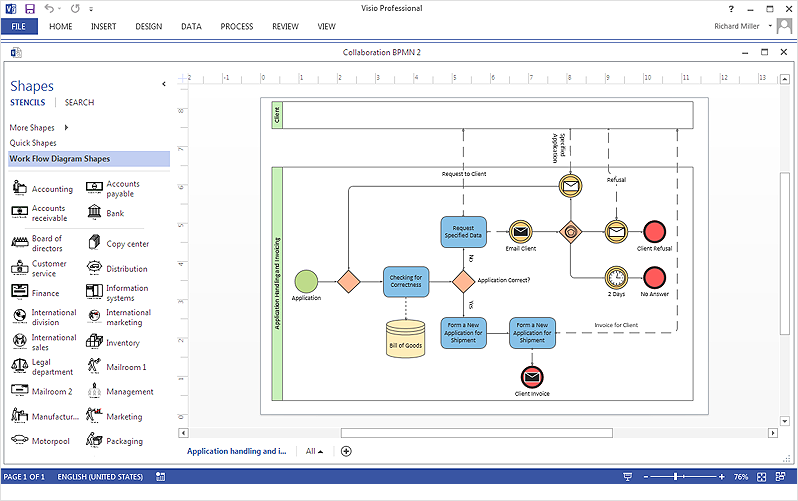
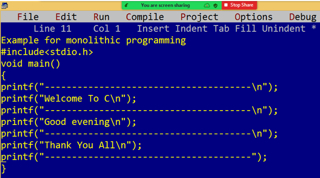
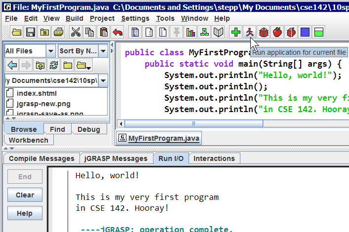
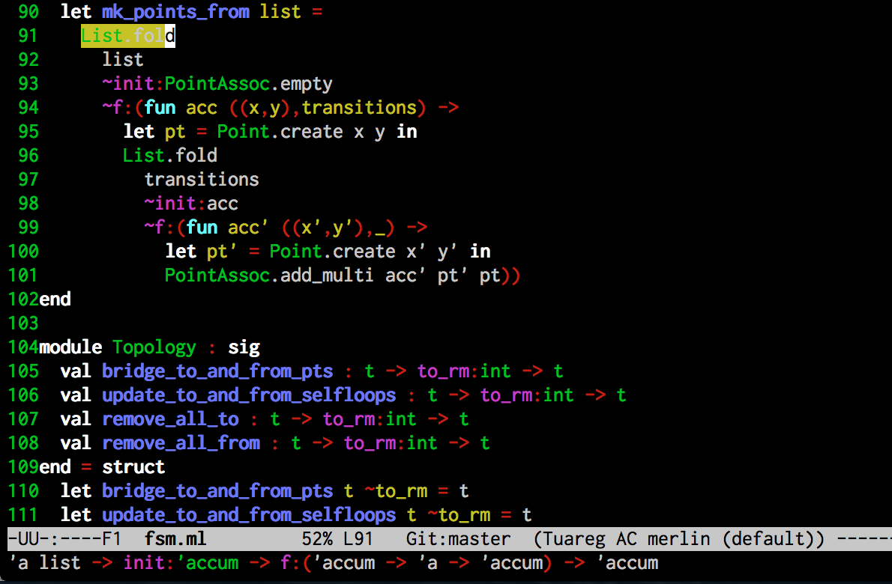
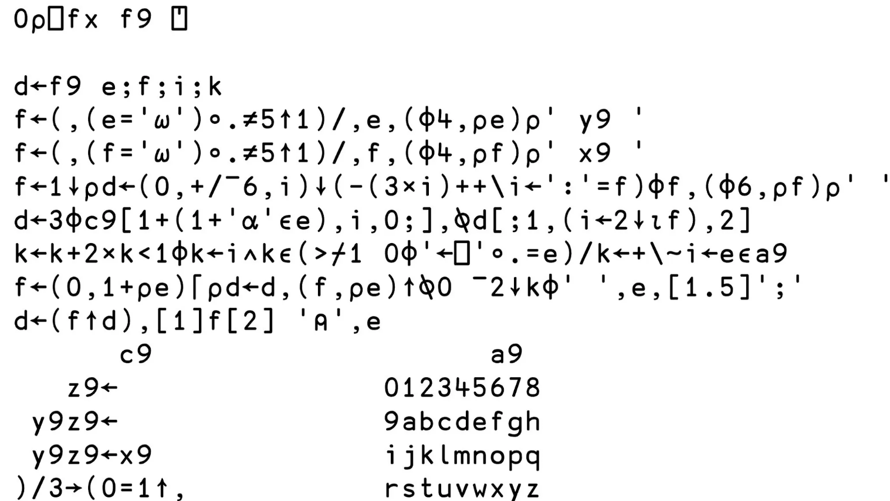
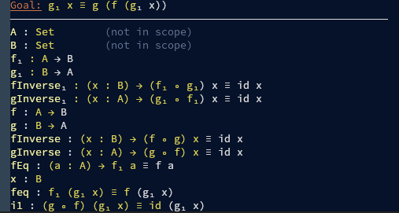

# 背景铺垫：形式验证

##### 时间线1：文档应用的技术
##### 时间线2：代码的各种流派

- 流程图：Visio，可能在传统的行业仍有应用
- 面向过程：C语言
- 面向对象：Java
- 函数式编程：OCaml
- APL
- 形式验证

数学的美感之一在于它的精确没有其它语言可以匹敌

代码有时候可以是一种艺术品

当一个东西足够基础，没有那么工程化，那么它就显得像一个游戏

参考文献：
- [Some Funny Math!! (25 ÷ 5 = 14)](https://www.youtube.com/watch?v=SeZ_gbBPUw0)
- 《1987年的“魔法软件”HyperCard：让孩子和工程师一起创造世界》
- Steam上各类与代码相关的游戏
- 各类Esolang
